# Energy Wallet QC Report — Ontario Input Set

**Generated:** 2026-04-13 07:51

**Source data:**

- `outputs/ontario/step4_energy_wallet.csv` (modified 2026-04-13 07:50)

- `outputs/ontario/step5_utility_bills.csv` (modified 2026-04-13 07:51)

**Rows:** 298,080 | **Columns:** 285 | **Years:** [2025, 2030, 2035]

## 0. Data Overview

| Dimension | # Values | Values |
| --- | --- | --- |
| `climate_zone` | 3 | CZ_5, CZ_6, CZ_7A |
| `dwelling_type` | 4 | apt, mob, row, sfd |
| `envelope_tier` | 3 | average, good, poor |
| `hvac_system` | 12 | condensing gas w AC, condensing gas wo AC, electric resistance w AC, electric resistance wo AC, non-condensing gas w AC, non-condensing gas wo AC, oil w AC, oil wo AC, propane w AC, propane wo AC, wood w AC, wood wo AC |
| `dhw_system` | 3 | electric resistance, gas, oil |
| `income_quintile` | 5 | 1st, 2nd, 3rd, 4th, 5th |
| `vehicle_1_type` | 4 | SUV, car, none, truck |
| `vehicle_1_category` | 2 | ICE, none |
| `has_home_charging` | 2 | no, yes |

| Alt Config | Values |
| --- | --- |
| `alt_hvac_system` | ccashp w electric backup |
| `alt_dhw_system` | HPWH, electric resistance |
| `alt_vehicle_1_category` | EV, none |

## 1. Average Energy Wallets Over Time

### 1.1 Weighted Average Base vs Alt by Year

| Year | Base ($/yr) | Alt ($/yr) | Diff ($/yr) | Diff % |
| --- | --- | --- | --- | --- |
| 2025 | $8,821 | $10,509 | $1,688 | +19.1% |
| 2030 | $8,604 | $8,351 | $-253 | -2.9% |
| 2035 | $8,459 | $7,955 | $-504 | -6.0% |

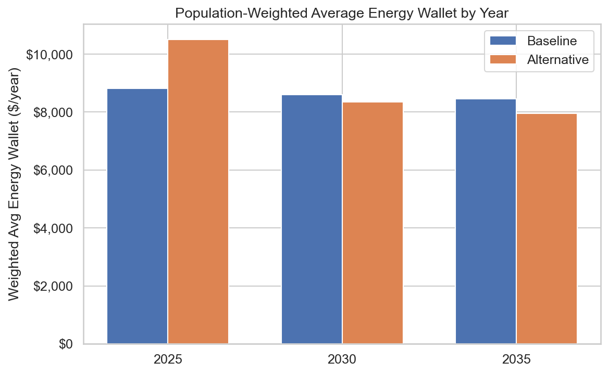

### 1.2 Cost Component Decomposition by Year

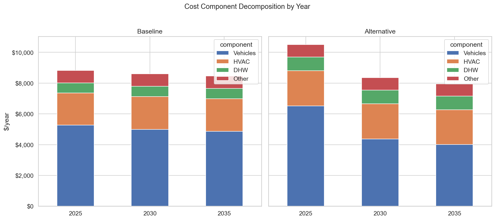

### 1.3 Component-Level Change (Alt - Base)

| Year | Vehicles Δ | HVAC Δ | DHW Δ | Other Δ | Total Δ |
| --- | --- | --- | --- | --- | --- |
| 2025 | $+1,261 | $+186 | $+240 | $+0 | $+1,688 |
| 2030 | $-637 | $+157 | $+227 | $+0 | $-253 |
| 2035 | $-859 | $+142 | $+213 | $+0 | $-504 |

### 1.4 Home Energy Wallet (Excluding Vehicles)

Isolating home energy costs (HVAC + DHW + Other) removes the impact of declining EV capital costs and shows the pure building-electrification cost delta.

| Year | Home Base ($/yr) | Home Alt ($/yr) | Diff ($/yr) | Diff % |
| --- | --- | --- | --- | --- |
| 2025 | $3,558 | $3,984 | $+426 | +12.0% |
| 2030 | $3,607 | $3,991 | $+384 | +10.6% |
| 2035 | $3,597 | $3,951 | $+355 | +9.9% |

HVAC equipment costs, efficiencies, and heating loads are **year-invariant** in the Ontario input set. The small changes in the home energy delta come from energy price trajectories: electricity prices shift from $43.75 (2025) → $43.05/MWh (2035) while natural gas rises from $11.09 → $12.12/MWh. This slightly narrows the electrification cost penalty over time, but the effect is modest compared to the EV capital cost declines that drive the total wallet improvement.

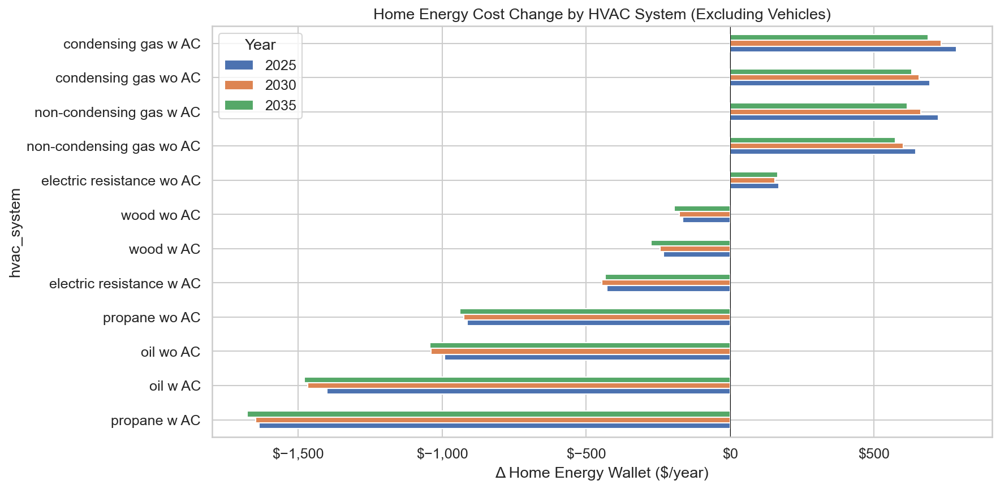

### 1.5 Home Energy Component Breakdown (Alt - Base)

| Year | HVAC Δ | DHW Δ | Other Δ | Home Total Δ |
| --- | --- | --- | --- | --- |
| 2025 | $+186 | $+240 | $+0 | $+426 |
| 2030 | $+157 | $+227 | $+0 | $+384 |
| 2035 | $+142 | $+213 | $+0 | $+355 |

All three home components show a consistent cost **increase** in the alternative configuration. The total home energy penalty is ~$400–430/yr, confirming that gas furnaces remain cheaper than ccASHP when EV savings are excluded.

## 2. Archetype Analysis — Who Has Higher/Lower Energy Wallets

### 2.1 By Dwelling Type

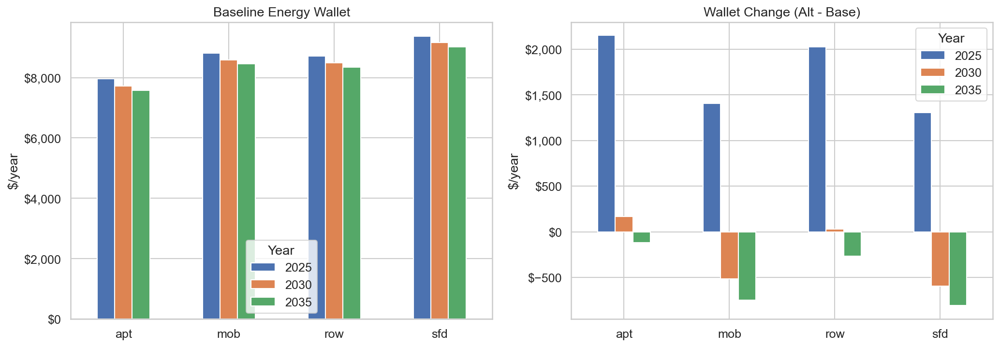

### 2.2 By Climate Zone

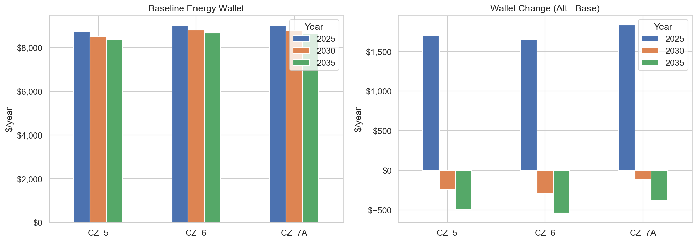

### 2.3 By HVAC System

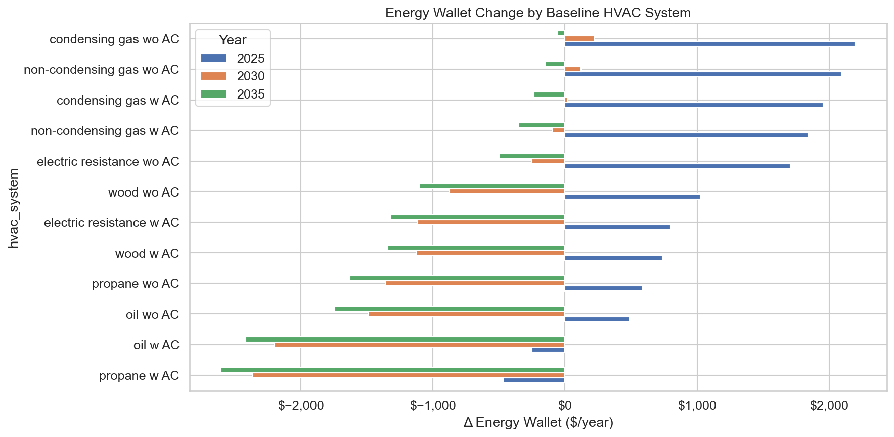

### 2.4 By Envelope Tier

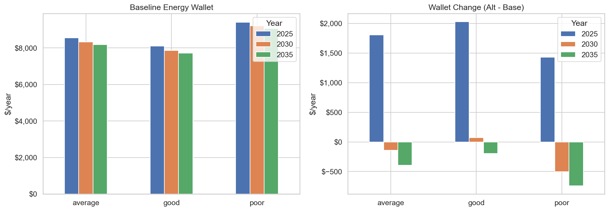

### 2.5 Summary Table: Top-5 Most Expensive and Cheapest Archetypes (2035)

**Top 5 most expensive baseline archetypes (2035):**

| Archetype | Base $/yr |
| --- | --- |
| sfd / CZ_7A / propane w AC / oil / v1=truck / charge=no / poor | $19,052 |
| sfd / CZ_7A / propane w AC / oil / v1=truck / charge=yes / poor | $19,052 |
| sfd / CZ_7A / oil wo AC / oil / v1=truck / charge=yes / poor | $19,034 |
| sfd / CZ_7A / oil wo AC / oil / v1=truck / charge=no / poor | $19,034 |
| sfd / CZ_7A / propane wo AC / oil / v1=truck / charge=yes / poor | $18,953 |

**Top 5 cheapest baseline archetypes (2035):**

| Archetype | Base $/yr |
| --- | --- |
| apt / CZ_6 / condensing gas wo AC / gas / v1=none / charge=no / good | $2,128 |
| apt / CZ_7A / non-condensing gas wo AC / gas / v1=none / charge=yes / good | $2,061 |
| apt / CZ_7A / non-condensing gas wo AC / gas / v1=none / charge=no / good | $2,061 |
| apt / CZ_7A / condensing gas wo AC / gas / v1=none / charge=yes / good | $2,030 |
| apt / CZ_7A / condensing gas wo AC / gas / v1=none / charge=no / good | $2,030 |

## 3. EV Charging Access Impact

### 3.1 EV Cost Breakdown: Home Charging vs No Home Charging

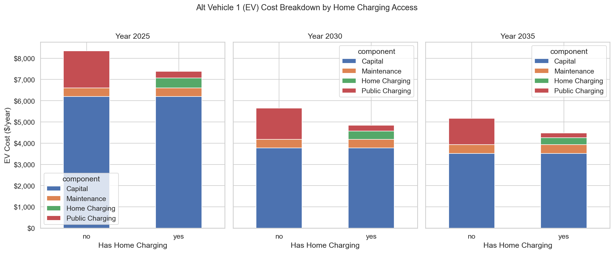

### 3.2 EV Charging Cost Table

| Year | Home Charging? | Home $ | Public $ | Total EV Fuel $ | Total V1 Cost $ |
| --- | --- | --- | --- | --- | --- |
| 2025 | yes | $462 | $315 | $777 | $7,383 |
| 2025 | no | $0 | $1,741 | $1,741 | $8,346 |
| 2030 | yes | $392 | $266 | $658 | $4,842 |
| 2030 | no | $0 | $1,471 | $1,471 | $5,655 |
| 2035 | yes | $326 | $224 | $549 | $4,476 |
| 2035 | no | $0 | $1,239 | $1,239 | $5,166 |

### 3.3 Total Energy Wallet: Home Charging vs Not (EV Archetypes Only)

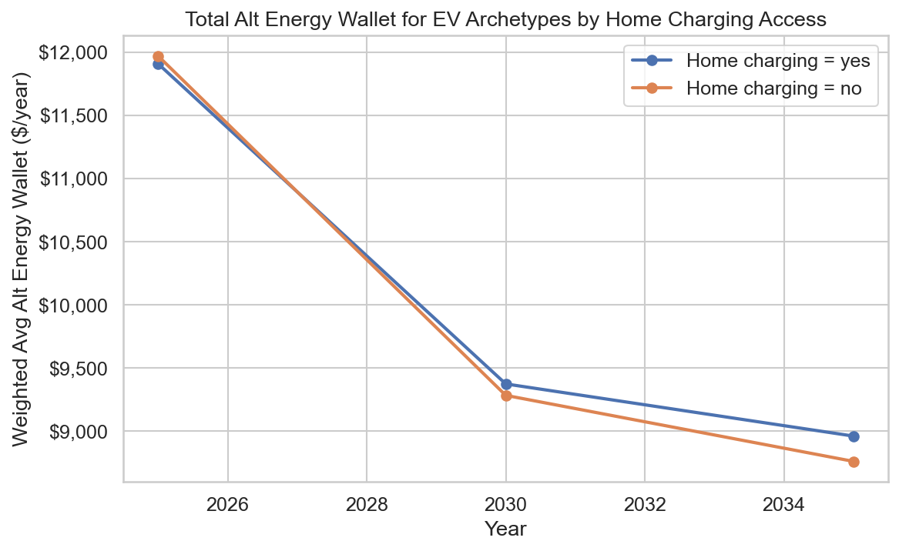

## 4. Validation & Sanity Checks

### 4.1 Weight Validation

- PASS: Weights consistent across years — sums = 2025: 0.905164, 2030: 0.905164, 2035: 0.905164

Weight sum per year: **0.9052** (< 1.0 is expected when not all archetypes have full adoption share mappings to alternatives, e.g., vehicle_1_type=none has no EV alternative).

- PASS: Step 1 weights sum to ~1.0 (pre-expansion) — sum = 1.000000

- PASS: No negative weights

### 4.2 Component Additivity

- PASS: vehicles + home = energy_wallet (base) — max residual = $0.0000

- PASS: vehicles + home = energy_wallet (alt) — max residual = $0.0000

- PASS: hvac + dhw + other = home (base) — max residual = $0.0000

- PASS: hvac + dhw + other = home (alt) — max residual = $0.0000

### 4.3 Utility Bill Reconciliation (Step 5)

- PASS: utility_bill_total + capital/maint = energy_wallet (base) — max residual = $0.0000

- PASS: utility_bill_total + capital/maint = energy_wallet (alt) — max residual = $0.0000

### 4.4 Zero-Cost Logic Checks

- PASS: ICE baseline vehicles have zero EV cost — max = $0.0000

- PASS: EV alt vehicles have zero gas cost — max = $0.0000

- PASS: 'none' vehicles have zero cost — max = $0.0000

### 4.5 Natural Gas Fixed Charge Logic

- INFO: All 298,080 rows use some natural gas in base config (via HVAC, DHW, or other). This is plausible for Ontario's gas-heavy building stock.

- INFO: All 298,080 rows use some natural gas in alt config (via HVAC, DHW, or other). This is plausible for Ontario's gas-heavy building stock.

### 4.6 Fuel Proportion Sum Check

- PASS: Heating fuel proportions sum to ~1.0 (base) — max deviation = 0.000000

- PASS: Heating fuel proportions sum to ~1.0 (alt) — max deviation = 0.000000

- PASS: DHW fuel proportions sum to ~1.0 (base) — max deviation = 0.000000

- PASS: DHW fuel proportions sum to ~1.0 (alt) — max deviation = 0.000000

## 5. Additional Pressure Tests

### 5.1 Distribution of Energy Wallet Diff %

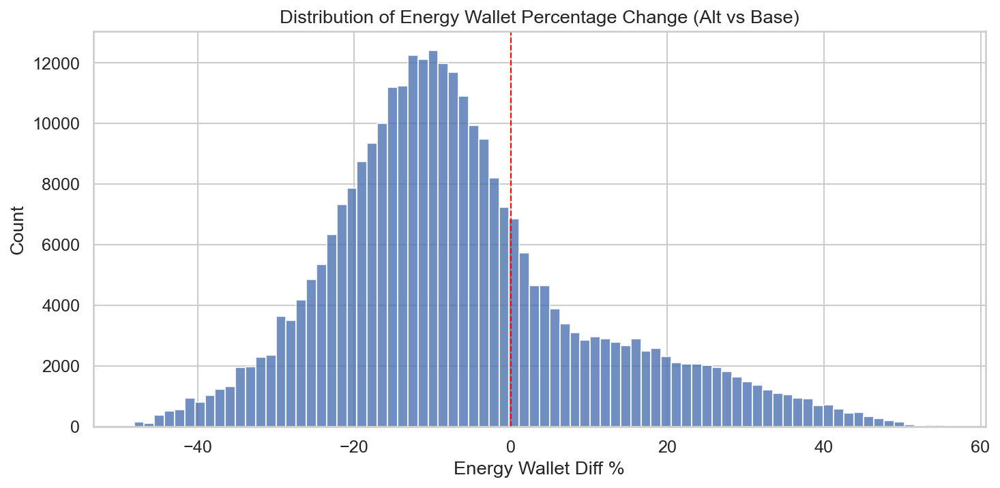

**Percentiles:** P5=-30.3% | P25=-17.4% | P50=-9.0% | P75=+1.4% | P95=+27.5%

- PASS: No extreme outliers (|diff%| > 100%)

### 5.2 Negative Cost Check

- PASS: No negative cost values

### 5.3 Panel Upgrade Cost Check

Rows with panel upgrade (base): 223,560 / 298,080

Rows with panel upgrade (alt): 223,560 / 298,080

**Alt panel upgrade archetypes (sample):**

| hvac_system | alt_hvac_system | vehicle_1_category | alt_vehicle_1_category | panel_upgrade_cost_alt | other_alt_panel_annual_capital |
| --- | --- | --- | --- | --- | --- |
| condensing gas w AC | ccashp w electric backup | ICE | EV | 5000 | 287.13935519563887 |
| condensing gas wo AC | ccashp w electric backup | ICE | EV | 5000 | 287.13935519563887 |
| electric resistance w AC | ccashp w electric backup | ICE | EV | 5000 | 287.13935519563887 |
| electric resistance wo AC | ccashp w electric backup | ICE | EV | 5000 | 287.13935519563887 |
| non-condensing gas w AC | ccashp w electric backup | ICE | EV | 5000 | 287.13935519563887 |
| non-condensing gas wo AC | ccashp w electric backup | ICE | EV | 5000 | 287.13935519563887 |
| oil w AC | ccashp w electric backup | ICE | EV | 5000 | 287.13935519563887 |
| oil wo AC | ccashp w electric backup | ICE | EV | 5000 | 287.13935519563887 |
| propane w AC | ccashp w electric backup | ICE | EV | 5000 | 287.13935519563887 |
| propane wo AC | ccashp w electric backup | ICE | EV | 5000 | 287.13935519563887 |

### 5.4 PMT Reasonableness Check

Spot-checking annualized capital vs purchase cost for vehicles:

- Purchase cost: $28,886 | Annualized: $2,902/yr | Life: 12 yrs | Rate: 0.03

- Simple (cost/life): $2,407/yr — PMT should be higher due to interest

- PASS: PMT > simple annualization (interest included) — PMT=$2,902 vs simple=$2,407

### 5.5 Utility Bill Breakdown Over Time

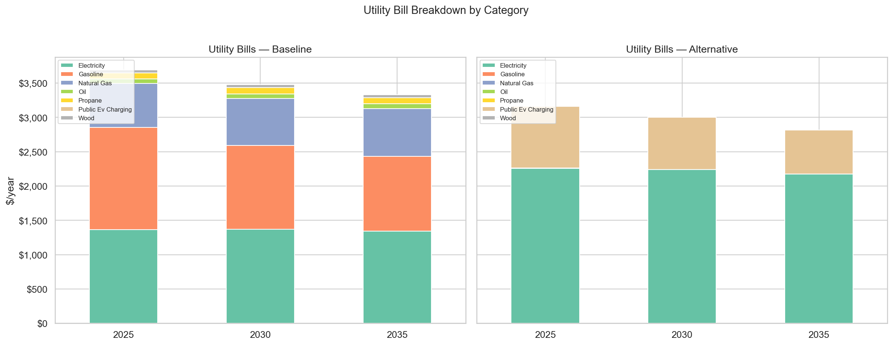

### 5.6 HVAC System Transition Analysis

What does switching from baseline HVAC to cold-climate ASHP do to heating costs?

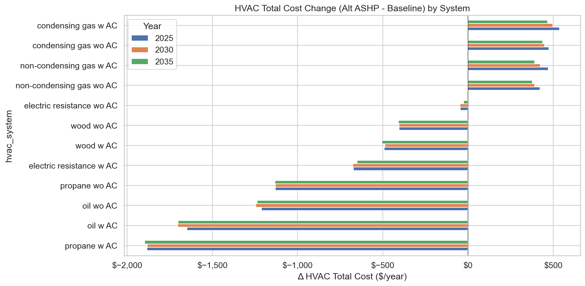

### 5.7 Vehicle Type Impact on Wallet

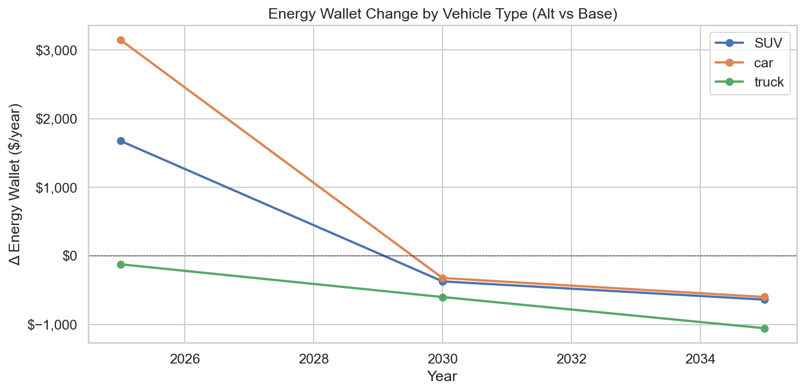

### 5.8 Electricity & Gas Bill Changes (Base vs Alt)

| Year | Elec Base | Elec Alt | Elec Δ | Gas Base | Gas Alt | Gas Δ |
| --- | --- | --- | --- | --- | --- | --- |
| 2025 | $1,364 | $2,260 | $+896 | $639 | $2 | $-637 |
| 2030 | $1,368 | $2,240 | $+872 | $682 | $3 | $-680 |
| 2035 | $1,342 | $2,175 | $+833 | $699 | $3 | $-696 |

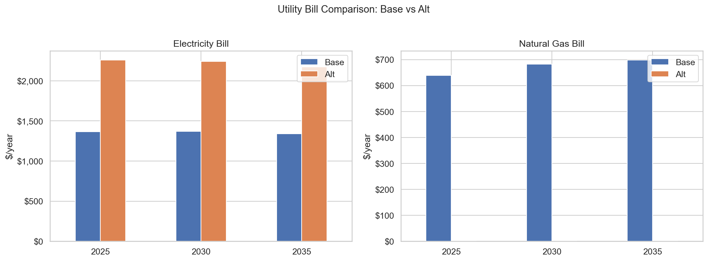

### 5.9 Utility Bills by HVAC System

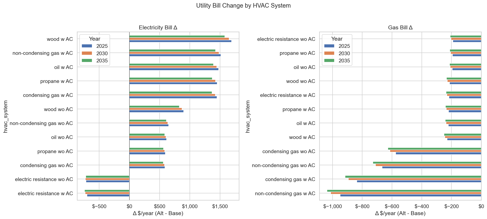

## 6. Year-Dependent Input Parameter Validation

**Critical check:** Do input parameters that vary by year get the correct year-specific values in Step 3?

### 6.1 Vehicle Purchase Costs by Year

**Input data (vehicle_costs.csv):**

| Year | Type | Category | Purchase Cost |
| --- | --- | --- | --- |
| 2025 | car | ICE | $28,886 |
| 2025 | car | EV | $65,498 |
| 2025 | SUV | ICE | $33,237 |
| 2025 | SUV | EV | $55,893 |
| 2025 | truck | ICE | $61,493 |
| 2025 | truck | EV | $71,144 |
| 2030 | car | ICE | $28,886 |
| 2030 | car | EV | $30,191 |
| 2030 | SUV | ICE | $33,237 |
| 2030 | SUV | EV | $34,541 |
| 2030 | truck | ICE | $61,493 |
| 2030 | truck | EV | $66,069 |
| 2035 | car | ICE | $28,886 |
| 2035 | car | EV | $27,834 |
| 2035 | SUV | ICE | $33,237 |
| 2035 | SUV | EV | $32,185 |
| 2035 | truck | ICE | $61,493 |
| 2035 | truck | EV | $62,365 |

**Step 3 output (what the model actually uses):**

| Year | Type | ICE Cost (base) | EV Cost (alt, actual) | EV Cost (expected) | Match? |
| --- | --- | --- | --- | --- | --- |
| 2025 | car | $28,886 | $65,498 | $65,498 | Y |
| 2025 | SUV | $33,237 | $55,893 | $55,893 | Y |
| 2025 | truck | $61,493 | $71,144 | $71,144 | Y |
| 2030 | car | $28,886 | $30,191 | $30,191 | Y |
| 2030 | SUV | $33,237 | $34,541 | $34,541 | Y |
| 2030 | truck | $61,493 | $66,069 | $66,069 | Y |
| 2035 | car | $28,886 | $27,834 | $27,834 | Y |
| 2035 | SUV | $33,237 | $32,185 | $32,185 | Y |
| 2035 | truck | $61,493 | $62,365 | $62,365 | Y |

- PASS: Vehicle purchase costs use correct year-dependent values

### 6.2 Vehicle Efficiency by Year

**Input data vs Step 3 output for car EV efficiency (CZ_5):**

| Year | Expected EV Eff | Actual EV Eff (alt) | Match? |
| --- | --- | --- | --- |
| 2025 | 0.1694 | 0.1694 | Y |
| 2030 | 0.1419 | 0.1419 | Y |
| 2035 | 0.1194 | 0.1194 | Y |

- PASS: Vehicle efficiency uses correct year-dependent values

### 6.3 EV Capital Cost Trajectory (Post-Fix)

With year-dependent costs flowing correctly, EV annualized capital now declines over time:

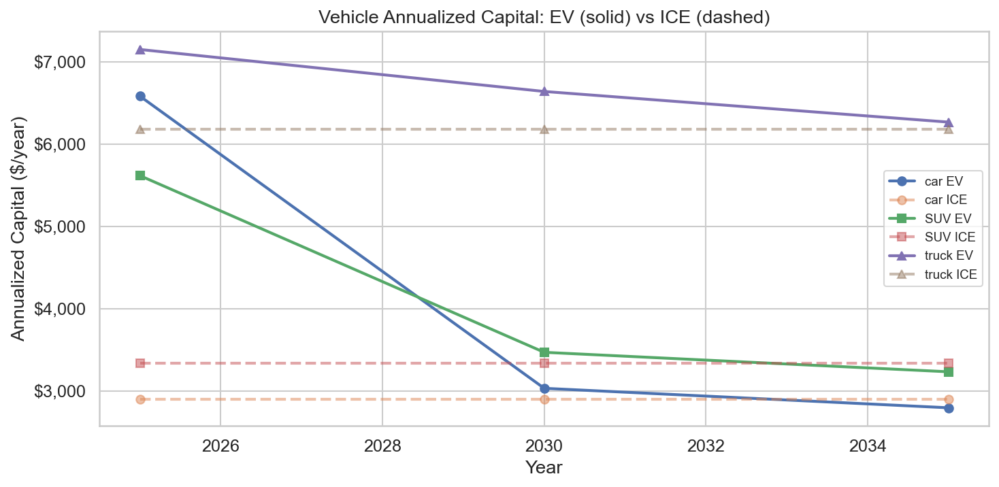

## 7. Summary

**Validation checks: 21/21 passed.**

### Key Findings

1. **All validation checks pass** — component additivity, utility bill reconciliation, fuel proportions, zero-cost logic, PMT calculations, and year-dependent parameter lookup.

2. **Year-dependent vehicle parameters now flow correctly** through Step 3 multi-lookup. EV purchase costs decline from $65k (2025) to $28k (2035) for cars, and vehicle efficiencies improve over time as expected.

3. The alternative configuration is **+19% more expensive in 2025** (driven by high EV capital costs) but becomes **6% cheaper by 2035** as EV costs decline — confirming the expected cost convergence trajectory.

4. Households **without home charging** pay ~$964/yr more in EV fuel costs due to reliance on public charging.

5. HVAC transition to ASHP **saves money** for oil/propane/wood heated homes but **increases costs** for gas-heated homes.

6. **Home energy costs (excluding vehicles) are consistently higher in the alt configuration** across all years, confirming that the total wallet improvement over time is driven by EV capital cost declines, not HVAC electrification savings. Gas furnaces remain cheaper than ccASHP when EV savings are excluded.

7. Switching to all-electric **increases electricity bills** but **reduces gas bills**. The net utility bill impact varies by baseline HVAC fuel type — gas-heated homes see the largest gas bill reduction but also the largest electricity increase.
